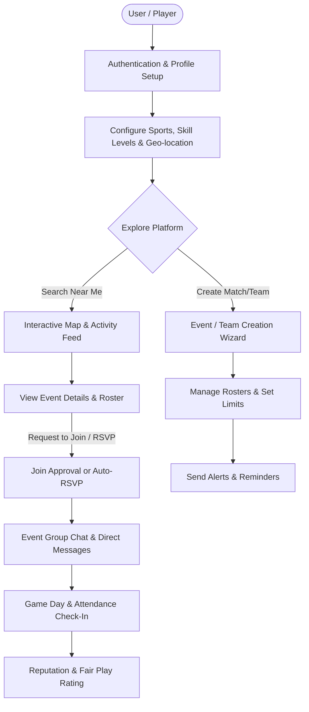
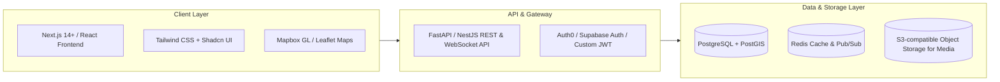
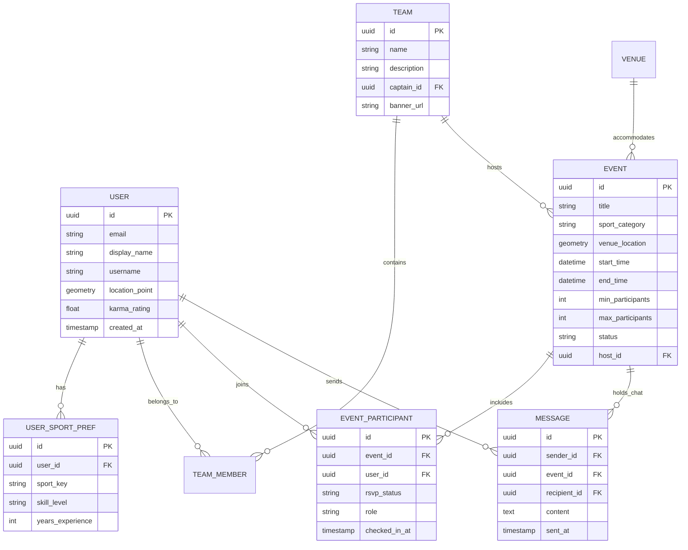

# Software Requirements Specification (SRS)
## Project: Social Finding & Activity Team-Up Platform ("TeamUp / SocialFinding")

**Document Version:** 1.0.0  
**Status:** Approved / Draft  
**Target Release:** MVP (Phase 1)  

---

## 1. Executive Summary & Vision

### 1.1 Problem Statement
Finding people with matching skill levels, availability, and geographic proximity to play sports (e.g., soccer, basketball, pickleball, tennis, badminton) or participate in group activities (e.g., board games, running, hiking, esports) is notoriously fragmented. People currently rely on disparate messaging groups (WhatsApp, Telegram, Facebook Groups) where scheduling is chaotic, roster spots are hard to fill, and reliability/no-shows are rampant.

### 1.2 Solution & Value Proposition
**SocialFinding** is an all-in-one web platform that bridges the gap between activity organizers, teams, and solo players. It provides:
- **Instant Discovery:** Geo-spatial search to discover local games, practices, and casual meetups happening near you.
- **Roster & Team Management:** Easy creation of teams and one-off matches with RSVP limits, waitlists, and role assignments.
- **Integrated Communication:** Direct messaging, event-specific group chats, and broadcast announcements.
- **Reliability & Fair Play System:** Attendance ratings and reputation scores to minimize ghosting and last-minute cancellations.

---

## 2. User Personas

| Persona | Role | Key Goals | Pain Points |
| :--- | :--- | :--- | :--- |
| **Alex (Solo Free Agent)** | Individual Player | Find pickup basketball or badminton games within 5 miles on weekday evenings; join welcoming teams. | Doesn't know enough local players; hates showing up to empty or overcrowded courts. |
| **Sarah (Team Captain)** | Team Organizer | Form an amateur soccer squad, recruit 3 reliable substitutes, collect RSVPs, and communicate match updates. | Chasing RSVPs across multiple group chats; no-shows leaving the team short-handed. |
| **David (Activity Coordinator)** | Event Host / Club Lead | Organize weekly open board game or running sessions for 15–30 participants; manage venue info and attendance caps. | Difficult to cap participant numbers and handle waitlists transparently. |

---

## 3. High-Level Architecture & User Flow

---

## 4. Functional Requirements

### 4.1 Module 1: User Identity, Profiles & Preferences

#### FR-1.1: Authentication & Authorization
- Users shall be able to register and sign in using Email/Password, Google OAuth, and Apple ID.
- Secure session management with JWT (Access + Refresh tokens).
- Role-based permissions: Guest (unauthenticated), Registered User, Team Admin/Host, Platform Moderator.

#### FR-1.2: Player Profile & Sports Passport
- **Basic Info:** Display name, handle (`@username`), avatar, bio, age bracket, and primary city/neighborhood.
- **Activity & Sports Portfolio:**
  - Add sports/activities (e.g., Football, Tennis, Hiking, D&D, Chess, Volleyball).
  - Self-assessed skill rating per activity: *Beginner*, *Intermediate*, *Advanced*, *Competitive*.
  - Preferred playing positions / roles (e.g., Goalkeeper, Point Guard, Support).
- **Availability Matrix:** Weekly recurring availability slots (e.g., Weekday evenings, Saturday mornings).
- **Privacy & Safety Settings:** Option to hide exact address (display fuzzy radius only), toggle profile discoverability.

---

### 4.2 Module 2: Activity & Team Creation

#### FR-2.1: Event / Match Creation Wizard
Event organizers can create an activity posting with the following parameters:
- **Activity Category & Subtype:** Sport, gaming, outdoor, fitness, hobby.
- **Game Format:** Pickup game, structured match, tournament, training session, or casual hangout.
- **Location:**
  - Physical venue with map pinpointing (coordinates, address, parking notes, indoor/outdoor indicator).
  - Virtual/Online (for esports/online games with voice server link).
- **Date, Time & Duration:** Single occurrence or recurring schedule (e.g., every Tuesday at 7:00 PM).
- **Capacity Controls:**
  - Minimum players required (threshold for event confirmation).
  - Maximum player capacity.
  - Automated waitlist (promotes waitlisted users when someone drops out).
- **Access Model:**
  - *Public (Instant Join):* Anyone matching skill criteria can RSVP.
  - *Request to Join (Approval Required):* Host reviews applicants before acceptance.
  - *Private (Invite Only):* Accessible only via direct link or team invite.
- **Cost Sharing:** Optional fee per player (e.g., court fee splitting) with payment instructions.

#### FR-2.2: Persistent Teams & Clubs
- Users can create persistent "Teams" or "Clubs" (e.g., "North District FC").
- Team roster with member roles: Owner/Captain, Co-Captain, Regular Member, Guest/Sub.
- Team schedule showing upcoming fixtures and team-internal matches.
- Team statistics (games played, win/loss record if competitive).

---

### 4.3 Module 3: Discovery & Matchmaking ("Social Finding")

#### FR-3.1: Geospatial & Filtered Search
- **Interactive Map View:** Visual cluster pins of upcoming activities nearby.
- **Feed / List View:** Chronological or proximity-sorted cards with clear status tags (`3 spots left`, `Waitlist only`, `Skill: Intermediate`).
- **Filter Parameters:**
  - Activity / Sport type.
  - Distance radius (e.g., within 2 km, 5 km, 15 km, 50 km).
  - Date range & time of day.
  - Skill level match.
  - Cost (Free vs Paid).
  - Gender preference (All, Co-ed, Men-only, Women-only).

#### FR-3.2: "Find a Team / Find a Player" Matchmaking Feed
- Dedicated "Free Agent" board where solo players broadcast their availability for teams needing ringers/substitutes.
- "Emergency Sub" instant alerts: Captains can broadcast a distress call (e.g., "Need 1 player in 2 hours near Central Park") notifying nearby users who opted into urgent invites.

---

### 4.4 Module 4: Real-Time Communication

#### FR-4.1: Activity Group Chat
- Every event automatically provisions a dedicated group chat upon creation.
- Chat lifecycle:
  - Accessible to confirmed participants and host.
  - Pinned announcement feature for host updates (e.g., "Court moved to Court 3").
  - Quick polling widget (e.g., voting on jersey color or venue).
  - Automatic system messages for join/leave events.

#### FR-4.2: Direct Messaging (1-to-1)
- Private messaging between users to discuss team invites or coordinate ride-shares.
- Anti-spam safeguard: Non-friends can only send an initial message request; recipient must accept before continuous conversation.

#### FR-4.3: Notifications System
- Multi-channel delivery: In-app notification center, web push notifications, and email digests.
- Event reminders: 24-hour and 2-hour pre-game reminders.
- Roster updates: Notifications when promoted from waitlist to active roster.

---

### 4.5 Module 5: Attendance Reliability & Fair Play ("Karma Score")

#### FR-5.1: Check-In & Attendance Verification
- Post-game check-in by host or QR-code based self check-in at the venue.
- Statuses: *Attended*, *Excused Absence* (canceled >12 hrs before), *Late Cancellation*, *No-Show (Ghost)*.

#### FR-5.2: Reliability Rating
- Each user displays an "Attendance Reliability" percentage (e.g., "96% Reliability Rate over 25 games").
- Repeated unexcused no-shows temporarily restrict instant RSVP privileges (requiring host manual approval).
- Endorsements: Peer badges for positive sportsmanship (e.g., "Punctual", "Team Player", "Great Sport").

---

## 5. Non-Functional Requirements (NFR)

### 5.1 Performance & Latency
- Page initial load time (LCP) shall be < 1.8 seconds on 4G connections.
- Geo-spatial queries (searching activities within radius) must return in < 250ms for up to 10,000 active nodes.
- Chat message delivery latency must be < 150ms via WebSocket connections.

### 5.2 Scalability
- Horizontal scalability for API gateways and WebSocket connection managers.
- Database spatial indexing utilizing PostgreSQL `PostGIS` / R-Tree indexes.
- Caching layer (Redis) for hot event feeds and user location data.

### 5.3 Security & Privacy
- **Data Protection:** HTTPS/TLS 1.3 in transit; AES-256 for sensitive stored credentials.
- **Location Obfuscation:** The public map should never display an individual player's home address; home locations are snapped to neighborhood centroids or fuzzed with a random 200m offset.
- **Content Moderation:** In-app reporting for harassment, spam, offensive profiles, or abusive chat messages with automated temporary silencing pending human review.
- Compliance with GDPR/CCPA for user data export and deletion ("Right to be Forgotten").

### 5.4 Usability & Accessibility
- **Responsive Web Design:** Fully optimized for mobile screens (viewport 360px+) and desktop viewports (1920px).
- **Accessibility:** Conformance with WCAG 2.1 Level AA standards (color contrast, screen reader aria-labels, full keyboard navigation).

---

## 6. Proposed Technical Stack

| Layer | Recommended Technology | Justification |
| :--- | :--- | :--- |
| **Frontend Framework** | **Next.js (App Router) + TypeScript** | Server-Side Rendering (SSR) for SEO-friendly public event pages; fast client navigation. |
| **Styling & UI Components** | **Tailwind CSS + Shadcn UI** | Rapid development, modern design system, full accessibility support out of the box. |
| **Mapping Engine** | **Mapbox GL JS** or **Leaflet.js + OpenStreetMap** | High performance vector maps, custom clustering, and route/distance visualization. |
| **Backend Framework** | **Node.js (NestJS) or Python (FastAPI)** | High throughput, excellent asynchronous I/O for real-time WebSockets and geo-queries. |
| **Database** | **PostgreSQL + PostGIS** | Gold standard for geospatial calculations (`ST_DWithin`, spatial joins, boundary checks). |
| **Real-Time / Cache** | **Redis & Socket.io / WebSockets** | Real-time chat messages, active user location caching, session state, and pub/sub alerts. |
| **Media Storage** | **Cloudflare R2 or AWS S3** | Inexpensive, fast CDN-backed storage for user avatars and venue imagery. |

---

## 7. Data Model & Entity Relationship Overview

---

## 8. Implementation Roadmap & Phases

### Phase 1: MVP Core (Weeks 1 – 6)
- [ ] User authentication (Email + Google sign-in).
- [ ] User profile creation with preferred sports and skill tiers.
- [ ] Event creation wizard (Location pinpoint, date/time, max players).
- [ ] Map and list discovery with radius and sport filter.
- [ ] RSVP & Basic Waitlist management.
- [ ] Event group chat room (WebSockets).

### Phase 2: Community & Retention (Weeks 7 – 12)
- [ ] Persistent Teams & Clubs with roster invites.
- [ ] Direct 1-on-1 messaging and friend lists.
- [ ] Check-in and Attendance Reliability ("Karma") rating system.
- [ ] Mobile PWA installation and Web Push notifications.
- [ ] "Emergency Substitute" broadcast notifications.

### Phase 3: Monetization & Venue Integration (Weeks 13+)
- [ ] Venue owner portal: Listing facilities, courts, and booking availability.
- [ ] In-app payment integration (Stripe) for tournament entry fees or split venue deposits.
- [ ] League and tournament ladder management bracket generator.
- [ ] Sponsorship and local sporting goods partner offers.

---

## 9. Risk Management & Mitigations

| Risk | Impact | Likelihood | Mitigation Strategy |
| :--- | :--- | :--- | :--- |
| **Cold Start / Low Density** | High | High | Focus launch on a single geographic city/neighborhood and 2–3 popular sports (e.g., Pickleball & Soccer) before wider rollout. |
| **No-Shows & Flakes** | High | High | Implement Attendance Reliability Score, automated reminder alerts, and require deposit or manual confirmation for low-karma users. |
| **User Safety / Harassment** | High | Low-Medium | In-app block/report workflows, obfuscate exact player locations, and enable women-only/private group settings. |
| **Inaccurate Skill Levels** | Medium | Medium | Clear self-assessment rubrics (e.g., standard tennis/pickleball NTRP scales) and peer post-game skill validations. |

---

## 10. Acceptance Criteria (User Story Samples)

### US-01: Joining a Pickup Match
- **Given** an authenticated user viewing an active public event with 9/10 spots filled,
- **When** the user clicks "Join Match",
- **Then** their status changes to "Confirmed", the spot count updates to 10/10 in real-time, the user is automatically added to the event group chat, and a calendar invite (`.ics`) is made available.

### US-02: Waitlist Promotion
- **Given** an event at full capacity with 2 players on the waitlist,
- **When** an active participant changes their RSVP to "Not Attending",
- **Then** the first user on the waitlist is automatically promoted to "Confirmed", notified via push/email, and the host's roster view updates instantly.
