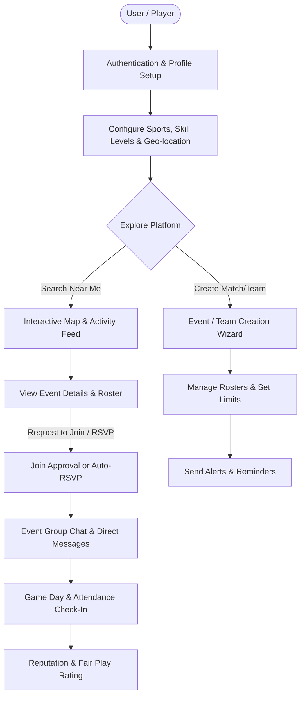

# 3. High-Level Architecture & User Flow

```mermaid
flowchart TD
    User([User / Player]) --> Auth[Authentication & Profile Setup]
    Auth --> Profile[Configure Sports, Skill Levels & Geo-location]
    
    Profile --> Discovery{Explore Platform}
    
    Discovery -->|Search Near Me| MapFeed[Interactive Map & Activity Feed]
    Discovery -->|Create Match/Team| EventCreate[Event / Team Creation Wizard]
    
    MapFeed --> ViewEvent[View Event Details & Roster]
    ViewEvent -->|Request to Join / RSVP| JoinFlow[Join Approval or Auto-RSVP]
    
    EventCreate --> ManageRoster[Manage Rosters & Set Limits]
    ManageRoster --> Notifications[Send Alerts & Reminders]
    
    JoinFlow --> GroupChat[Event Group Chat & Direct Messages]
    GroupChat --> MatchDay[Game Day & Attendance Check-In]
    MatchDay --> KarmaReview[Reputation & Fair Play Rating]
```
