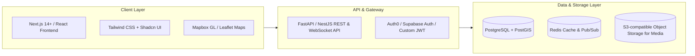

# 6. Proposed Technical Stack

| Layer | Recommended Technology | Justification |
| :--- | :--- | :--- |
| **Frontend Framework** | **Next.js (App Router) + TypeScript** | Server-Side Rendering (SSR) for SEO-friendly public event pages; fast client navigation. |
| **Styling & UI Components** | **Tailwind CSS + Shadcn UI** | Rapid development, modern design system, full accessibility support out of the box. |
| **Mapping Engine** | **Mapbox GL JS** or **Leaflet.js + OpenStreetMap** | High performance vector maps, custom clustering, and route/distance visualization. |
| **Backend Framework** | **Node.js (NestJS) or Python (FastAPI)** | High throughput, excellent asynchronous I/O for real-time WebSockets and geo-queries. |
| **Database** | **PostgreSQL + PostGIS** | Gold standard for geospatial calculations (`ST_DWithin`, spatial joins, boundary checks). |
| **Real-Time / Cache** | **Redis & Socket.io / WebSockets** | Real-time chat messages, active user location caching, session state, and pub/sub alerts. |
| **Media Storage** | **Cloudflare R2 or AWS S3** | Inexpensive, fast CDN-backed storage for user avatars and venue imagery. |
