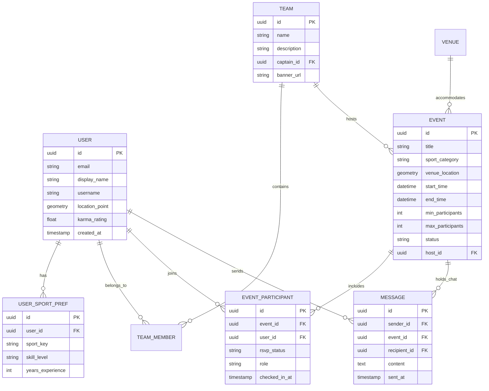

# 7. Data Model & Entity Relationship Overview

```mermaid
erDiagram
    USER ||--o{ USER_SPORT_PREF : has
    USER ||--o{ TEAM_MEMBER : belongs_to
    USER ||--o{ EVENT_PARTICIPANT : joins
    USER ||--o{ MESSAGE : sends
    
    TEAM ||--o{ TEAM_MEMBER : contains
    TEAM ||--o{ EVENT : hosts
    
    EVENT ||--o{ EVENT_PARTICIPANT : includes
    EVENT ||--o{ MESSAGE : holds_chat
    VENUE ||--o{ EVENT : accommodates
    
    USER {
        uuid id PK
        string email
        string display_name
        string username
        geometry location_point
        float karma_rating
        timestamp created_at
    }
    
    USER_SPORT_PREF {
        uuid id PK
        uuid user_id FK
        string sport_key
        string skill_level
        int years_experience
    }

    TEAM {
        uuid id PK
        string name
        string description
        uuid captain_id FK
        string banner_url
    }

    EVENT {
        uuid id PK
        string title
        string sport_category
        geometry venue_location
        datetime start_time
        datetime end_time
        int min_participants
        int max_participants
        string status
        uuid host_id FK
    }

    EVENT_PARTICIPANT {
        uuid id PK
        uuid event_id FK
        uuid user_id FK
        string rsvp_status
        string role
        timestamp checked_in_at
    }

    MESSAGE {
        uuid id PK
        uuid sender_id FK
        uuid event_id FK
        uuid recipient_id FK
        text content
        timestamp sent_at
    }
```
